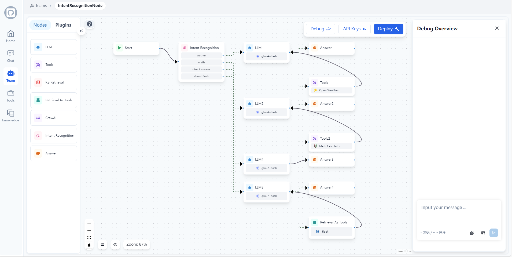

## 📃 Flock (Flexible Low-code Orchestrating Collaborative-agent Kits)

<p align="center">
  <a href="./README_cn.md">简体中文</a> |
  <a href="../README.md">English</a> |
  <a href="./README_ja.md">日本語</a> |
  <a href="#how-to-get-started">始め方</a>
</p>

> [!TIP]
>
> ### 🎉 最新アップデート 2024/11/12
>
> - **意図認識ノード**: 新しい意図認識ノードが追加され、プリセットされたカテゴリに基づいてユーザー入力の意図を自動的に識別し、マルチ分類ルーティングをサポートします！
>   
>
> - **CrewAI ノードのサポート**: ワークフローで CrewAI の強力なマルチエージェント機能を活用できるようになりました！洗練されたエージェントチームを作成し、複雑な協調タスクを簡単に編成できます。
>   

### Flock は、ワークフローベースのローコードプラットフォームで、チャットボット、RAG アプリケーション、マルチエージェントチームの調整を迅速に構築するためのプラットフォームです。LangChain と LangGraph をベースに構築され、柔軟なローコード協調エージェント編成ソリューションを提供し、チャットボット、RAG アプリケーション、エージェント、マルチエージェントシステムをサポートし、オフライン運用機能も備えています。

<video src="https://private-user-images.githubusercontent.com/49232224/386539219-5dc96133-72f3-4cc3-9f50-096c38bde715.mp4?jwt=eyJhbGciOiJIUzI1NiIsInR5cCI6IkpXVCJ9.eyJpc3MiOiJnaXRodWIuY29tIiwiYXVkIjoicmF3LmdpdGh1YnVzZXJjb250ZW50LmNvbSIsImtleSI6ImtleTUiLCJleHAiOjE3MzE2NjMzNDQsIm5iZiI6MTczMTY2MzA0NCwicGF0aCI6Ii80OTIzMjIyNC8zODY1MzkyMTktNWRjOTYxMzMtNzJmMy00Y2MzLTlmNTAtMDk2YzM4YmRlNzE1Lm1wND9YLUFtei1BbGdvcml0aG09QVdTNC1ITUFDLVNIQTI1NiZYLUFtei1DcmVkZW50aWFsPUFLSUFWQ09EWUxTQTUzUFFLNFpBJTJGMjAyNDExMTUlMkZ1cy1lYXN0LTElMkZzMyUyRmF3czRfcmVxdWVzdCZYLUFtei1EYXRlPTIwMjQxMTE1VDA5MzA0NFomWC1BbXotRXhwaXJlcz0zMDAmWC1BbXotU2lnbmF0dXJlPWVhOWY1NTc1Mjk5YWU1MjZmNmQyNmY3Mzk0YjY2MGYyMzlmZWQ2MTVkMjExODEwNmY3YmMxYTVmNGRhNzMxZWEmWC1BbXotU2lnbmVkSGVhZGVycz1ob3N0In0.69R3pTktxrl8C6tdduABLiRhkhwdfeVO3vlGGTGK4to" data-canonical-src="https://private-user-images.githubusercontent.com/49232224/386539219-5dc96133-72f3-4cc3-9f50-096c38bde715.mp4?jwt=eyJhbGciOiJIUzI1NiIsInR5cCI6IkpXVCJ9.eyJpc3MiOiJnaXRodWIuY29tIiwiYXVkIjoicmF3LmdpdGh1YnVzZXJjb250ZW50LmNvbSIsImtleSI6ImtleTUiLCJleHAiOjE3MzE2NjMzNDQsIm5iZiI6MTczMTY2MzA0NCwicGF0aCI6Ii80OTIzMjIyNC8zODY1MzkyMTktNWRjOTYxMzMtNzJmMy00Y2MzLTlmNTAtMDk2YzM4YmRlNzE1Lm1wND9YLUFtei1BbGdvcml0aG09QVdTNC1ITUFDLVNIQTI1NiZYLUFtei1DcmVkZW50aWFsPUFLSUFWQ09EWUxTQTUzUFFLNFpBJTJGMjAyNDExMTUlMkZ1cy1lYXN0LTElMkZzMyUyRmF3czRfcmVxdWVzdCZYLUFtei1EYXRlPTIwMjQxMTE1VDA5MzA0NFomWC1BbXotRXhwaXJlcz0zMDAmWC1BbXotU2lnbmF0dXJlPWVhOWY1NTc1Mjk5YWU1MjZmNmQyNmY3Mzk0YjY2MGYyMzlmZWQ2MTVkMjExODEwNmY3YmMxYTVmNGRhNzMxZWEmWC1BbXotU2lnbmVkSGVhZGVycz1ob3N0In0.69R3pTktxrl8C6tdduABLiRhkhwdfeVO3vlGGTGK4to" controls="controls" muted="muted" class="d-block rounded-bottom-2 border-top width-fit" style="max-height:640px; min-height: 200px">
 </video>

### 🤖️ 概要


### ワークフロー



### エージェントチャット


### 知識検索


### ヒューマン・イン・ザ・ループ（人間の承認または LLM の再考または人間への助けを求める）

<p>
  
  
</p>

Flock は、大規模言語モデル（LLM）アプリケーションを開発するためのオープンソースプラットフォームを目指しています。これは、LangChain と LangGraph の概念を利用した LLM ベースのアプリケーションです。チャットボット、RAG アプリケーション、エージェント、およびマルチエージェントシステムをサポートする LLMOps ソリューションのスイートを作成し、オフライン操作の機能を備えることを目指しています。

[StreetLamb](https://github.com/StreetLamb)プロジェクトおよびその[tribe](https://github.com/StreetLamb/tribe)プロジェクトに触発され、Flock は多くのアプローチとコードを採用しています。この基盤の上に、新しい機能と方向性を導入しています。

このプロジェクトのレイアウトの一部は、[Lobe-chat](https://github.com/lobehub/lobe-chat)、[Dify](https://github.com/langgenius/dify)、および[fastgpt](https://github.com/labring/FastGPT)を参考にしています。これらはすべて優れたオープンソースプロジェクトであり、感謝しています 🙇‍。

### 👨‍💻 開発

プロジェクトの技術スタック：LangChain + LangGraph + React + Next.js + Chakra UI + PostgreSQL

> [!NOTE]
>
> ### 🛠️ ツールシステム
>
> Flock には様々な組み込みツールが付属しており、カスタムツールの簡単な統合をサポートしています。利用可能なツールと独自のツールの追加方法については、[ツールガイド](Add_New_Tools_Guide.md)をご覧ください。

> ### 🤖 モデルシステム
>
> Flock は様々なモデルプロバイダーをサポートしており、新しいプロバイダーの追加も容易です。サポートされているモデルと新しいプロバイダーの追加方法については、[モデルガイド](Add_New_Model_Providers_Guide.md)をご覧ください。

### 💡 ロードマップ

1 アプリ

- [x] チャットボット
- [x] シンプル RAG
- [x] 階層エージェント
- [x] シーケンシャルエージェント
- [x] ワークフロー
- [x] 意図認識ノード - ユーザー入力の意図を自動的に識別し、異なる処理フローにルーティング
- [x] CrewAI 統合 ---進行中
- [ ] さらに多くのマルチエージェント

2 モデル

- [x] OpenAI
- [x] ZhipuAI
- [x] Siliconflow
- [x] Ollama
- [x] Qwen
- [ ] Xinference

3 その他

- [x] ツール呼び出し
- [x] I18n
- [ ] Langchain テンプレート

### 🏘️ ハイライト

- 永続 �� な会話：チャット履歴を保存および維持し、会話を続けるとができます。
- 可観測性：LangSmith を使用してエージェントのパフォーマンスと出力をリアルタイムで監視および追跡し、効率的に動作するようにします。
- ツール呼び出し：エージェントが外部ツールや API を利用できるようにします。
- 検索強化生成：エージェントが内部知識ベースを利用して推論できるようにします。
- ヒューマン・イン・ザ・ループ：ツール呼び出し前に人間の承認を有効にします。
- オープンソースモデル：llama、Qwen、Glm などのオープンソース LLM モデルを使用します。
- マルチテナンシー：複数のユーザーとチームを管理およびサポートします。

### 始め方

#### 1. 準備

##### 1.1 コードをクローン

git clone https://github.com/Onelevenvy/flock.git

##### 1.2 環境設定ファイルをコピー

```bash
cp .env.example .env
```

##### 1.3 秘密鍵を生成

.env ファイルのいくつかの環境変数には、デフォルト値として changethis が設定されています。
これらを秘密鍵に変更する必要があります。秘密鍵を生成するには、次のコマンドを実行します ���

```bash
python -c "import secrets; print(secrets.token_urlsafe(32))"
```

内容をコピーしてパスワード/秘密鍵として使用します。もう一度実して別の安全な鍵を生成します。

##### 1.3 postgres、qdrant、redis をインストール

```bash
cd docker
docker compose  --env-file ../.env up -d
```

#### 2. バックエンドを実行

##### 2.1 基本環境のインストール

サーバーの起動には Python 3.10.x が必要です。Python 環境を迅速にインストールするには、pyenv を使用することをお勧めします。

追加の Python ージョンをインストールするには、pyenv install を使用します。

```bash
pyenv install 3.10
```

"3.10" Python 環境に切り替えるには、次のコマンドを使用します：

```bash
pyenv global 3.10
```

次の手順に従います：
"backend"ディレクトリに移動します：

```bash
cd backend
```

環境をアクティブにします。

```bash
poetry env use 3.10
poetry install
```

##### 2.2 初期データの設定

```bash
# DBを起動させる
python /app/app/backend_pre_start.py

# マイグレーションを実行
alembic upgrade head

# DBに初期データを作成
python /app/app/initial_data.py
```

##### 2.3 unicorn を実行

```bash
 uvicorn app.main:app --reload --log-level debug
```

##### 2.4 celery を実行（rag 機能を使用する場合のみ）

```bash
poetry run celery -A app.core.celery_app.celery_app worker --loglevel=debug
```

#### 3. フロントエンドを実行

##### 3.1 web ディレクトリに移動して依存関係をインストール

```bash
cd web
pnpm install
```

##### 3.2 web サービスを起動

```bash
cd web
pnpm dev

# または pnpm build してから pnpm start
```

## Star History

[](https://star-history.com/#Onelevenvy/flock&Date)
